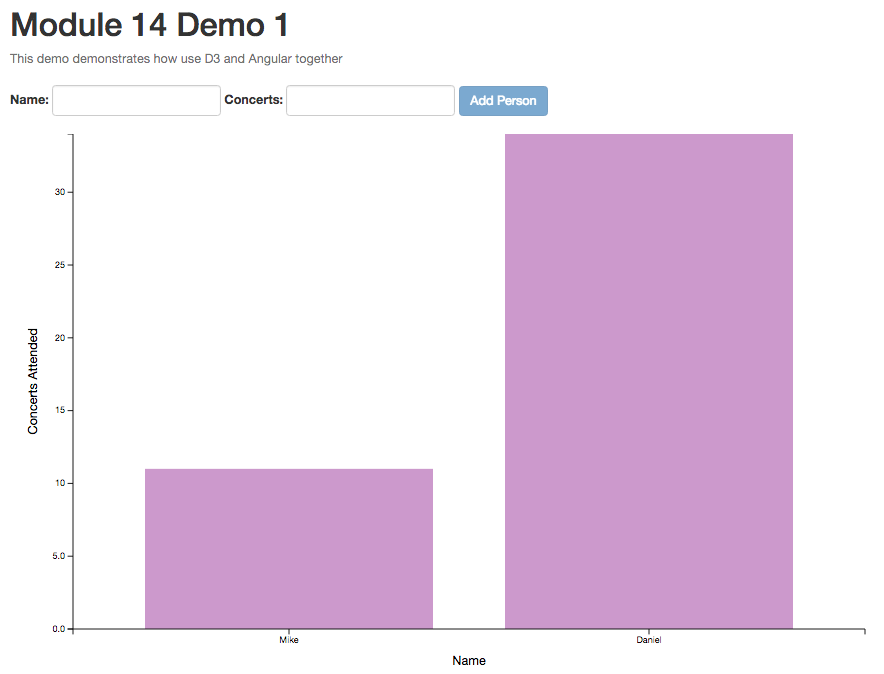

## Demo 1: D3 + Angular

This example demonstrates how to write custom Angular directives to integrate the use of D3.js charts in the Angular framework. By using the reusability pattern suggested in earlier modules, this illustrates the simplicity with which charts can be updated. 

The final product looks like this:

